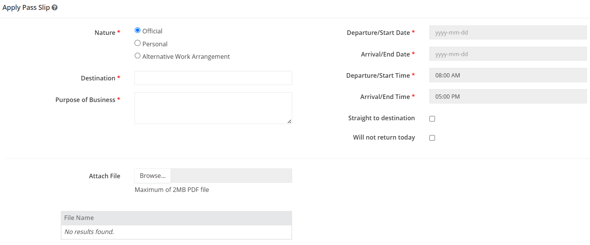
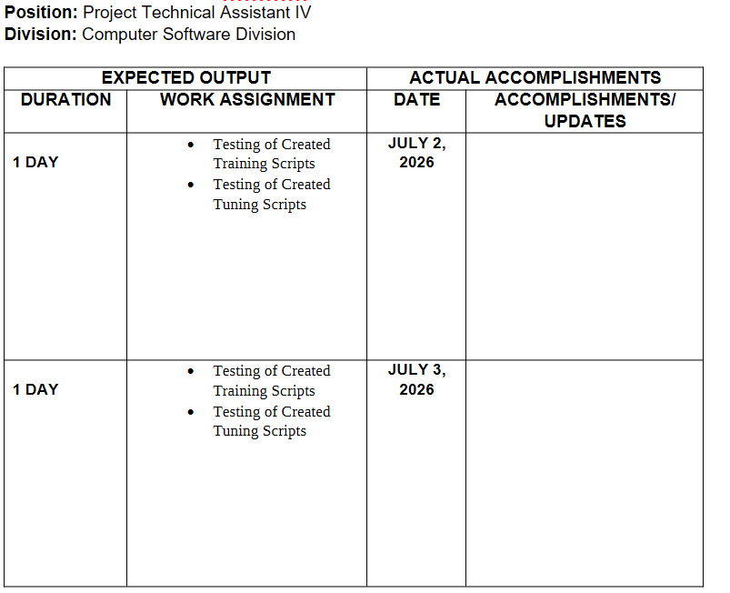
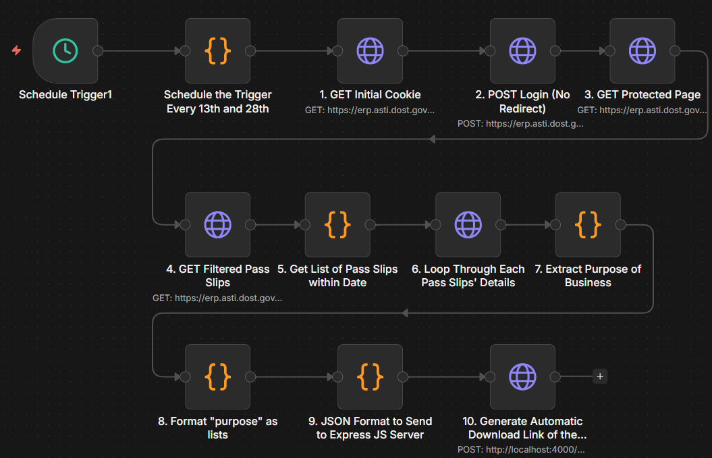
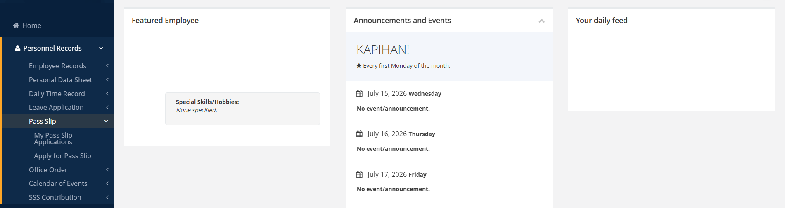
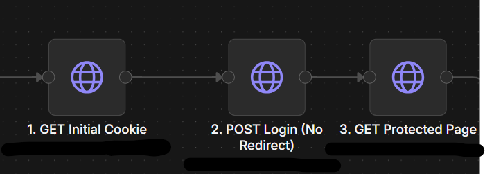
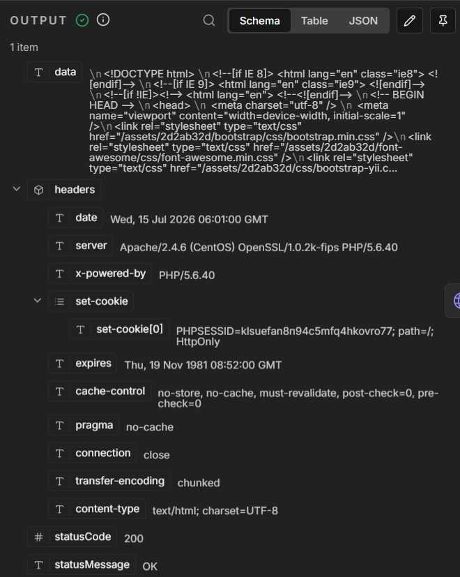
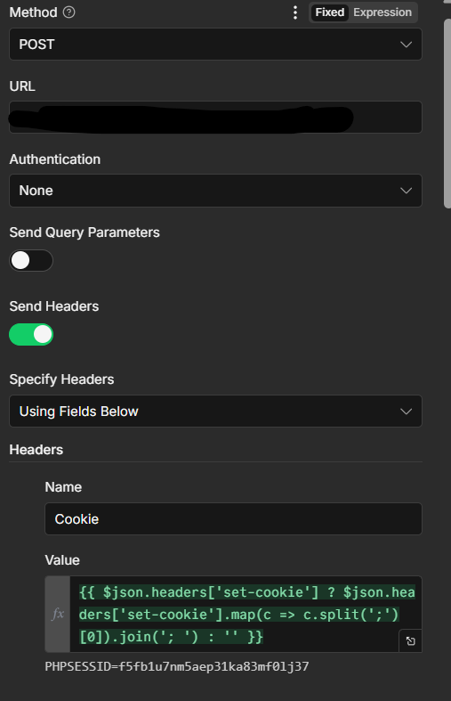
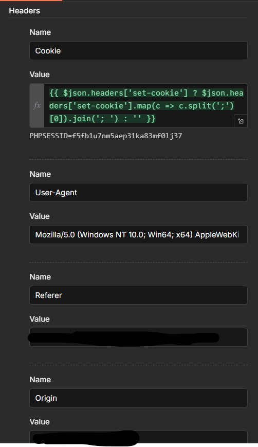
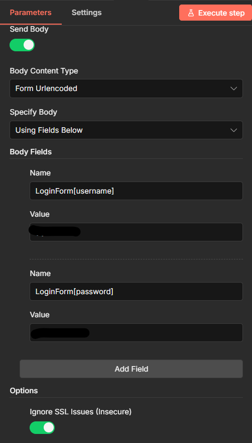

# AWA Accomplishment Report Filler

## Problem
A manual process is being observed when filling accomplishment reports in my current company:
1. You have to file your *Pass Slips* to be able to work from another site via the Enterprise Resource Planning (See images/image Below)


2. When that is done, you then accomplish the *Individual Accomplishment Report* via a docx template as seen below

- The duration is always per day (1 Day)
- The work assignment should align from the ERP's "Purpose of Business" filed
- The date should be exactly as what is filed in the ERP. Any incorrect date input results in RESUBMISSION of the form with appropriate fields.

3. However, the problem is for two times already, I have to resubmit the forms due to incorrect date inputs. 

## Solution
I developed a workflow that reduces the need to manually input details in the three aformentioned table rows. Only the *Accomplishment Updates* which is still heavily manual needs to be updated.

In the future, the workflow will add an additional field to automate accomplishment/weekly updates via a simple automated scrape from the Teams channel where the WEekly Updates is sent to the supervisors.

# The Workflow


## Scheduled Trigger

The first two nodes (not numbered) triggers a Javascript to run the check for the current day of the month. Usual cutoff for payroll occurs every 15th and 30th (or last day of the month). To accomodate this, the workflow is designed to trigger every 13th and 28/29th day of the month, or two days from the last day of cuttoff.

### Code in Javascript for Trigger
```javascript
const today = new Date();

const day = today.getDate();
const lastDay = new Date(
    today.getFullYear(),
    today.getMonth() + 1,
    0
).getDate();

const shouldRun =
    day === 13 ||
    day === 15 ||
    day === lastDay - 3 ||
    day === lastDay - 1;

if (!shouldRun) {
    return [];
}

return items;
```

## Nodes 1 to 3 - Access the Personal Page of the User in ERP
The step by step if manually done is as follows:
1. Access the login page of the ERP and input the credential:


2. Once inside, in the left navigation bar, press Personnel Records > Pass Slips > My Pass Slip Applications


This is easier said and done when done via manual. However, do this repeatedly every day will result in too much overhead. Hence, the first three nodes represent these process sequentially.


### Node 1: GET Request to Obtain Cookie

The first node is a GET request to create a cookie that all subsequent HTTP requests will use for access to the website. The GET request is simply to trigger a website visit for which inside its response is a "set-cookie" header containing a value to be used to establish a session, known as a cookie.


### Node 2: Username and Password Entry

The second node imitates the login action in ERP via a POST request to the form submission. This is done by sending your username and password via the body of the request to the same index used in the previous node.

 



**NOTE**: The current process in unsecured. If one wishes to use this on their account, consider using it internally
within the network or via VPN. Do not publish workflow in the internet to avoid unauthorized process.

**NOTE**: "Ignore SSL Issues" is toggled due to the requirement to obtain the certificate along with its private key from the server where the ERP is hosted. This is not obtainable unless there is security access to the server. For this purposes, it is toggled ON but it adds to the additional need to access the tool only internally.

### Node 3: GET Request to Obtain Protected User Page

To finally enter the personal page of the user, one must send a GET request to the same source since the first node. This will then result in a different result inside its data output

## Nodes 
